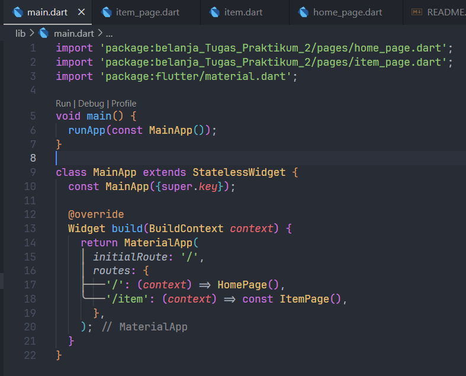

# belanja - UTS Pemrograman Mobile

A new Flutter project.

## Getting Started

This project is a starting point for a Flutter application.

A few resources to get you started if this is your first Flutter project:

- [Lab: Write your first Flutter app](https://docs.flutter.dev/get-started/codelab)
- [Cookbook: Useful Flutter samples](https://docs.flutter.dev/cookbook)

For help getting started with Flutter development, view the
[online documentation](https://docs.flutter.dev/), which offers tutorials,
samples, guidance on mobile development, and a full API reference.

### Langkah 1 

Tulis main.dart seperti gambar dibawah ini:

### Langkah 2

> Mendefinisikan Route

Buat file item.dart dan isi dengan kode dibawah ini:

### Langkah 3

Buat file home_page.dart dan isikan dengan kode dibawah ini:

### Langkah 4

Buat file item_page.dart dan tuliskan kode dibawah ini:

### Langkah 5

Berikut hasil dari kode diatas:

