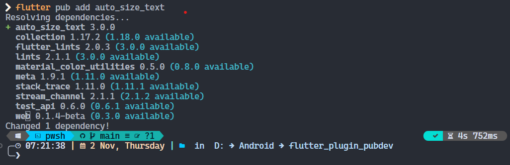
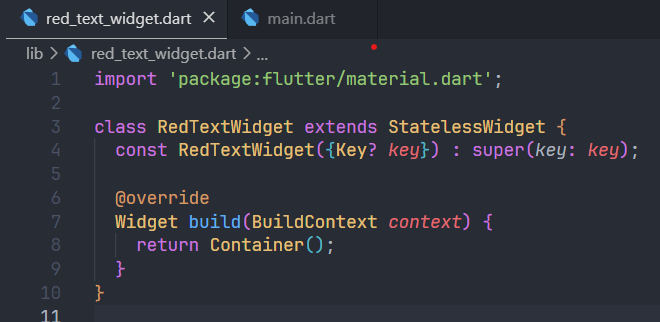

# flutter_plugin_pubdev

A new Flutter project.

## Getting Started

This project is a starting point for a Flutter application.

A few resources to get you started if this is your first Flutter project:

- [Lab: Write your first Flutter app](https://docs.flutter.dev/get-started/codelab)
- [Cookbook: Useful Flutter samples](https://docs.flutter.dev/cookbook)

For help getting started with Flutter development, view the
[online documentation](https://docs.flutter.dev/), which offers tutorials,
samples, guidance on mobile development, and a full API reference.

## Praktikum Menerapkan Plugin di Project Flutter

### Menambahkan Plugin *auto_size_text* Menggunakan Terminal

Maka akan tampil nama plugin beserta versinya di file pubspec.yaml pada bagian dependencies.

### Buat File Baru dengan Nama *red_text_widget.dart*

