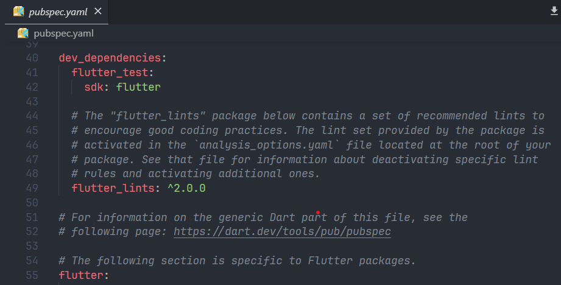

# flutter_plugin_pubdev

A new Flutter project.

## Getting Started

This project is a starting point for a Flutter application.

A few resources to get you started if this is your first Flutter project:

- [Lab: Write your first Flutter app](https://docs.flutter.dev/get-started/codelab)
- [Cookbook: Useful Flutter samples](https://docs.flutter.dev/cookbook)

For help getting started with Flutter development, view the
[online documentation](https://docs.flutter.dev/), which offers tutorials,
samples, guidance on mobile development, and a full API reference.

## Praktikum Menerapkan Plugin di Project Flutter


### Menambahkan Plugin *auto_size_text* Menggunakan Terminal


Maka akan tampil nama plugin beserta versinya di file pubspec.yaml pada bagian dependencies.




### Buat File Baru dengan Nama *red_text_widget.dart*


### Tambahkan Widget AutoSizeText pada *red_text_widget.dart*


Error terjadi karena *text* belom diinisialisasi

### Buat Variable text dan Parameter di Constructor


### Tambahkan widget di main.dart


### Output


## Tugas Praktikum

### Jelaskan maksud dari langkah 2 pada praktikum tersebut

> Langkah 2 digunakan untuk menambahakan plugin *auto_size_text* pada project fluttter dengan perintah `flutter pub add auto_size_text` pada terminal. Plugin ini digunakan untuk mengatur ukuran teks secara otomatis sesuai dengan ruang yang tersedia.

### Jelaskan maksud dari langkah 5 pada praktikum tersebut

> Pada langkah 5 dibuat sebuah variabel *text* dan parameter pada construktor class *RedTextWidget*. Ketika parameter *RedTextWidget* dipanggil pada *main.dart* maka akan muncul text yang diinginkan

### Pada langkah 6 terdapat 2 widget yang ditambahkan, jelaskan fungsi dan perbedaannya!

> Widget 1
```
Container(
        color: Colors.yellowAccent,
        width: 50,
        child: const RedTextWidget(
                text: 'You have pushed the button this many times:',
        ),
),
```
> Pada program diatas,didalam  widget Container dipanggil fungsi *RedTextWidget* yang sudah di definisikan sebelumnya sehingga text yang ditulis akan mengikuti atusan dari *RedtextWidget*. Teks diatas akan memiliki background kuning dan lebar 50

> Widget 2

```
Container(
              color: Colors.greenAccent,
              width: 100,
              child: const Text(
                'You have pushed the button this many times:',
              ),
            ),
```

> Pada widget diatas, didalam widget Container diisi teks dengan warna background hijau dan lebar 100 

### Jelaskan maksud dari tiap parameter yang ada di dalam plugin auto_size_text

> 1. **Key** : Parameter ini digunakan untuk mengontrol bagaimana satu widget menggantikan widget lain dalam pohon widget. Key adalah cara untuk mengidentifikasi widget secara unik.

> 2. **textKey** : key yang digunakan untuk mengatur key pada widget Text yang dihasilkan oleh auto_size_text. Key digunakan untuk mengidentifikasi widget secara unik

> 3. **style** : Jika non-null, ini adalah objek TextStyle yang digunakan untuk menentukan gaya teks seperti warna, jenis font, ketebalan, dll.

> 4. **minFontSize** : batasan ukuran font minimum yang akan digunakan saat menyesuaikan ukuran teks secara otomatis. Namun, parameter ini diabaikan jika _presetFontSizes_ diatur.

> 5. **maxFontSize** : mirip dengan minFontSize, tetapi untuk batas ukuran font maksimum. Batasan ukuran font maksimum yang akan digunakan saat menyesuaikan ukuran teks secara otomatis. Namun, parameter ini diabaikan jika _presetFontSizes_ diatur.

> 6. **stepGranularity** : Parameter ini mengontrol ukuran langkah ketika menyesuaikan ukuran font teks sesuai dengan batasan.

> 7. **presetFontSizes** : Daftar ukuran font yang telah ditentukan sebelumnya untuk digunakan dalam penyesuaian ukuran teks. Penting untuk mengatur daftar ini dalam urutan menurun.

> 8. **group** : Menggunakan nilai yang sama dalam parameter ini untuk beberapa widget auto_size_text akan menyinkronkan ukuran font mereka.

> 9. **textAlign** : Parameter yang digunakan untuk mengontrol penataan horizontal teks dalam widget.

> 10. **textDirection** : Parameter yang digunakan untuk mengontrol arah teks, seperti kiri-ke-kanan atau kanan-ke-kiri.

> 11. **locale** : Parameter yang digunakan untuk digunakan untuk memilih jenis font ketika karakter Unicode yang sama dapat dirender secara berbeda tergantung pada bahasa atau wilayah.

> 12. **softWrap** : Parameter yang digunakan untuk mengontrol apakah teks harus mematahkan baris pada pemisah baris lembut.

> 13. **wrapWords** : Parameter yang digunakan untuk mengontrol apakah kata-kata yang tidak muat dalam satu baris harus dibungkus. Defaultnya true untuk berperilaku seperti widget Text.

> 14. **overflow** : Parameter yang digunakan untuk mengontrol cara menangani visual overflow teks jika melebihi batas widget.

> 15. **overflowReplacement** : Widget yang ditampilkan jika teks melebihi batas widget.

> 16. **textScaleFactor** : Jumlah piksel font untuk setiap piksel logis. Juga memengaruhi minFontSize, maxFontSize, dan presetFontSizes.

> 17. **maxLines** : Jumlah maksimum baris yang teks akan tampilkan.

> 18. **semanticsLabel** : Label semantis alternatif untuk teks ini.
