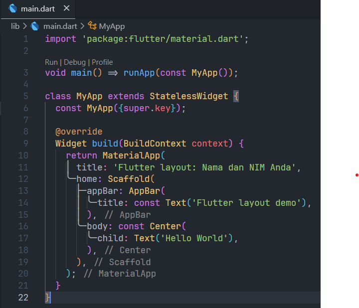
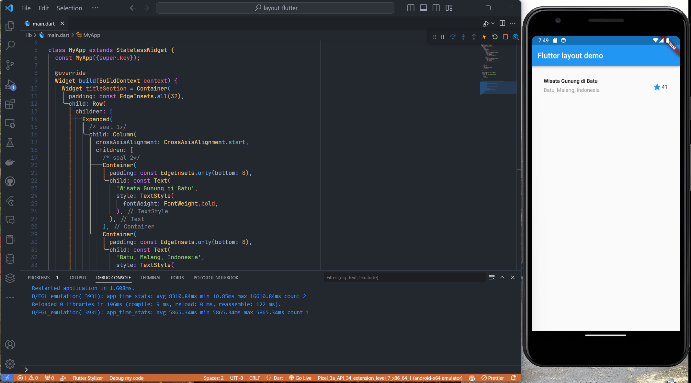
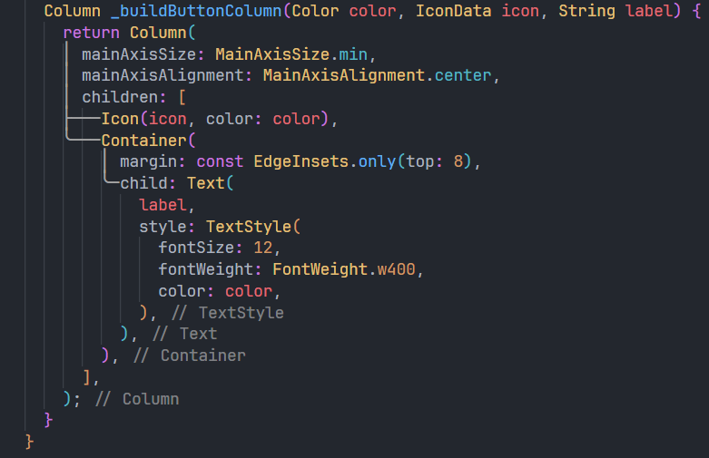
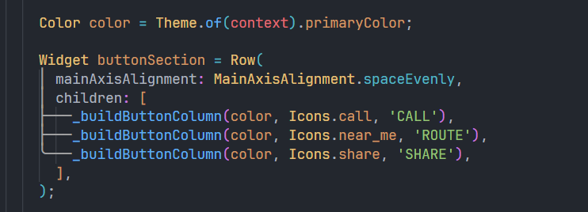
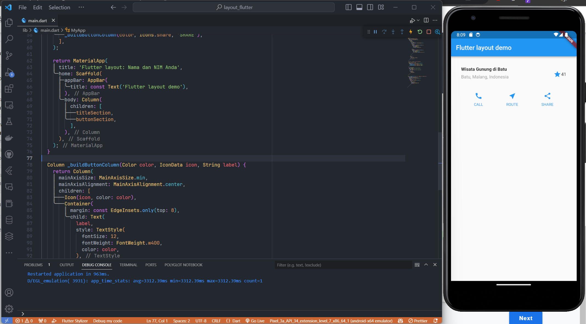
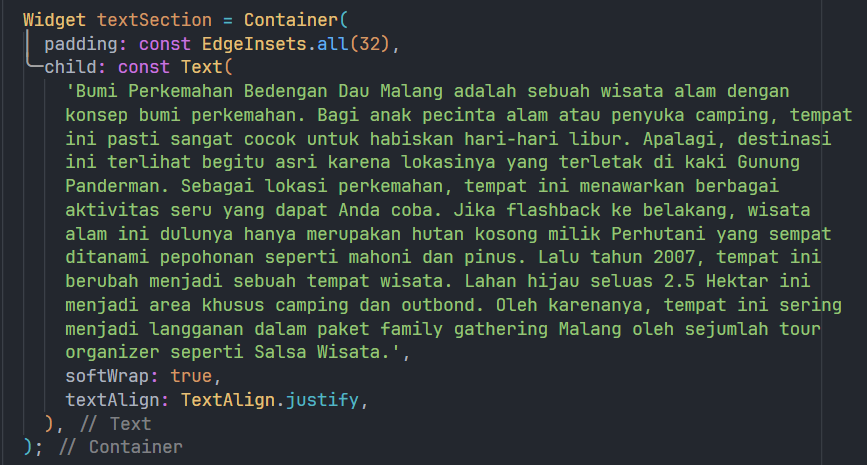
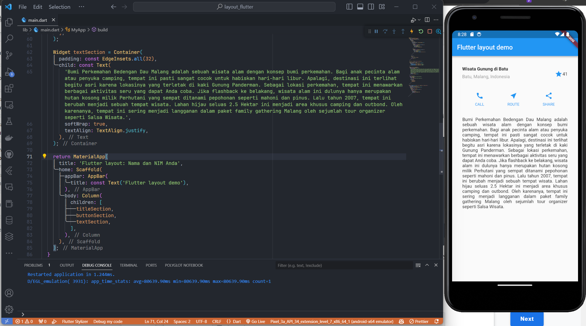
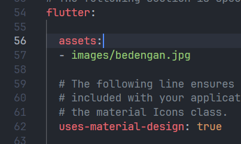
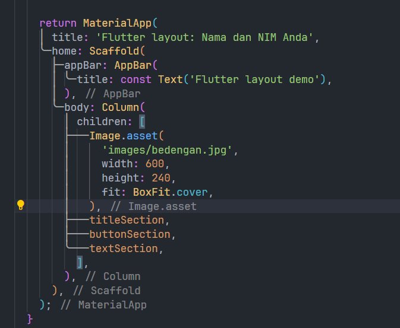
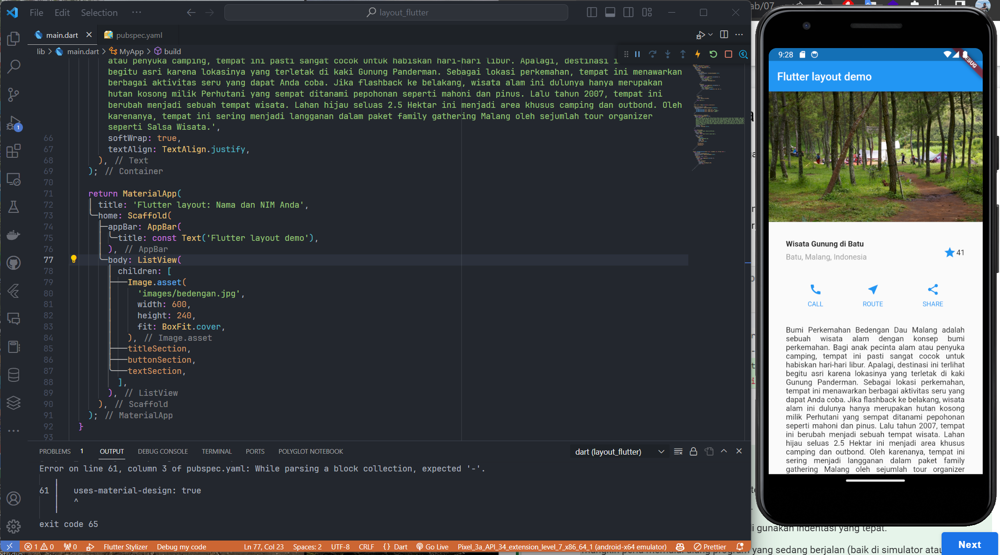

# layout_flutter

A new Flutter project.

## Getting Started

This project is a starting point for a Flutter application.

A few resources to get you started if this is your first Flutter project:

- [Lab: Write your first Flutter app](https://docs.flutter.dev/get-started/codelab)
- [Cookbook: Useful Flutter samples](https://docs.flutter.dev/cookbook)

## Praktikum 1

Membangun layout di flutter

### Langkah 1

Buat project flutter baru dengan nama 'layout_flutter'. Lalu ubah code program pada main.dart

### Langkah 2

Tambahkan kode berikut di bagian atas metode build() di dalam kelas MyApp. Berikut dengan hasilnya

## Praktikum 2

Implementasi Button Row

### Langkah 1

> Buat method Column \_buildButtonColumn

Bagian tombol berisi 3 kolom yang menggunakan tata letak yang sama—sebuah ikon di atas baris teks. Kolom pada baris ini diberi jarak yang sama, dan teks serta ikon diberi warna primer.

### Langkah 2

> Buat widget buttonSection

Buat Fungsi untuk menambahkan ikon langsung ke kolom. Teks berada di dalam Container dengan margin hanya di bagian atas, yang memisahkan teks dari ikon.

Tambahkan kode berikut tepat di bawah deklarasi titleSection di dalam metode build():

### Langkah 3

> Tambah button section ke body

Tambahkan variabel buttonSection ke dalam body seperti berikut:

## Praktikum 3

Implementasi Text Section

### Langkah 1

> Buat widget textSection

Tentukan bagian teks sebagai variabel. Masukkan teks ke dalam Container dan tambahkan padding di sepanjang setiap tepinya. Tambahkan kode berikut tepat di bawah deklarasi buttonSection:

### Langkah 2

> Tambahkan variabel text section ke body

Tambahkan widget variabel textSection ke dalam body seperti berikut:

## Praktikum 4

Implementasi Text Section

### Langkah 1

> Siapkan aset gambar

Anda dapat mencari gambar di internet yang ingin ditampilkan. Buatlah folder images di root project layout_flutter. Masukkan file gambar tersebut ke folder images, lalu set nama file tersebut ke file pubspec.yaml seperti berikut:

### Langkah 2

> Tambahkan gambar ke body

Tambahkan aset gambar ke dalam body seperti berikut:

### Langkah 3

> Terakhir, ubah menjadi ListView

Pada langkah terakhir ini, atur semua elemen dalam ListView, bukan Column, karena ListView mendukung scroll yang dinamis saat aplikasi dijalankan pada perangkat yang resolusinya lebih kecil.

