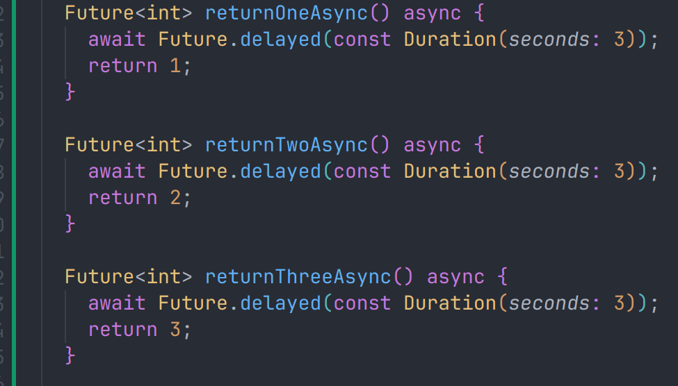
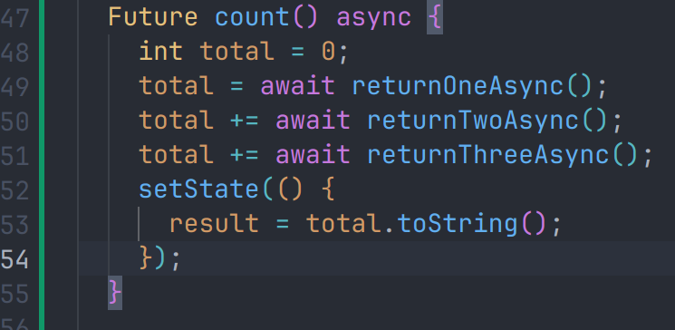
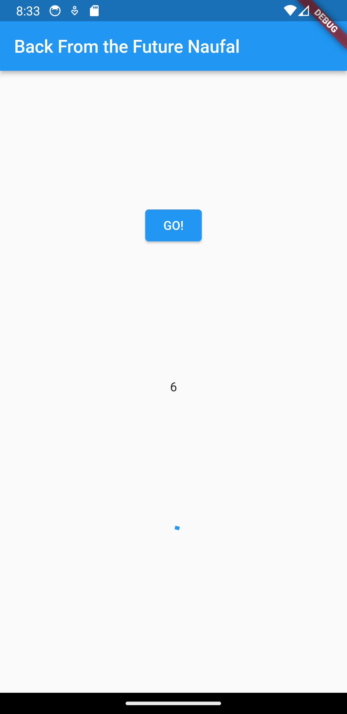

# Pertemuan Minggu 12 | Program Asynchronous
---

## Mengunduh Data dari Web Service

### Menambahkan dependensi ```http```
Jika berhasil install plugin, pastikan plugin ```http``` telah ada di file ```pubspec``` ini seperti berikut.


### Buka file ```main.dart```
ketik kode dibawah ini


### Tambah method getData()
Tambahkan method ini ke dalam ```class _FuturePageState``` yang berguna untuk mengambil data dari API Google Books.


### Tambah kode di ElevatedButton
Tambahkan kode pada ```onPressed``` di ```ElevatedButton``` seperti berikut.


### Hasil 


#### Soal 1
Tambahkan nama panggilan Anda pada ```title``` app sebagai identitas hasil pekerjaan Anda.


#### Soal 2
Carilah judul buku favorit Anda di Google Books, lalu ganti ID buku pada variabel ```path``` di kode tersebut. Caranya ambil di URL browser Anda seperti gambar berikut ini.


#### Soal 3
- Jelaskan maksud kode langkah 5 tersebut terkait substring dan catchError!
- Capture hasil praktikum Anda berupa GIF dan lampirkan di README. Lalu lakukan commit dengan pesan "W12: Soal 3".

> substring digunakan untuk mengambil substring 0 sampai 499 karakter dari teks dalam tubuh respons HTTP. ini dilakukan menggunakan metode ```substring(0, 450)``` pada String


---
## Menggunakan await/async untuk menghindari callbacks

### Buka file ```main.dart```
Tambahkan tiga method berisi kode seperti berikut di dalam ```class _FuturePageState```



### Tambahkan method ```count()```
Lalu tambahkan lagi method ini di bawah ketiga method sebelumnya.


### Panggil ```count()```
Lakukan comment kode sebelumnya, ubah isi kode ```onPressed()``` menjadi seperti berikut.


### Hasil
Akhirnya, run atau tekan F5 jika aplikasi belum running. Maka Anda akan melihat seperti gambar berikut, hasil angka 6 akan tampil setelah delay 9 detik.


#### Soal 4
- Jelaskan maksud kode langkah 1 dan 2 tersebut!
- Capture hasil praktikum Anda berupa GIF dan lampirkan di README. Lalu lakukan commit dengan pesan "**W12: Soal 4**".

> Program ini mendefinisikan tiga fungsi asinkron menggunakan kata kunci async dan await di dalamnya. Setiap fungsi adalah contoh operasi asinkron sederhana yang mengembalikan nilai setelah jeda waktu tertentu menggunakan Future.delayed.


## Menggunakan Completer di Future

### Tambahkan Variabel dan Method
Tambahkan variabel late dan method di ```class _FuturePageState``` seperti ini.


