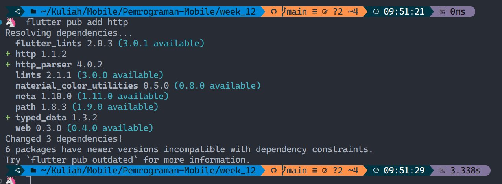
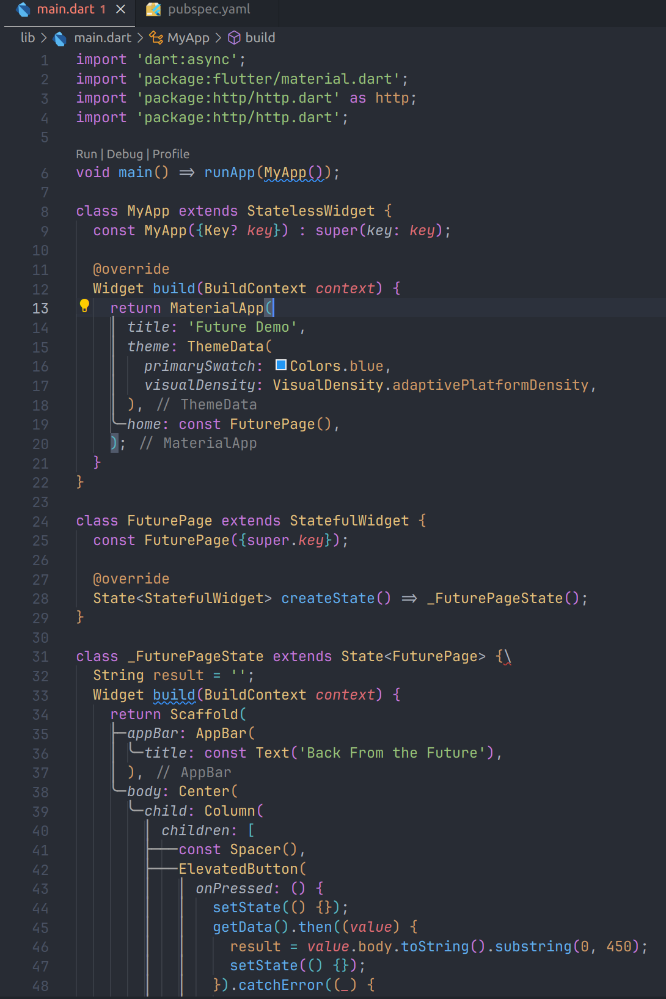
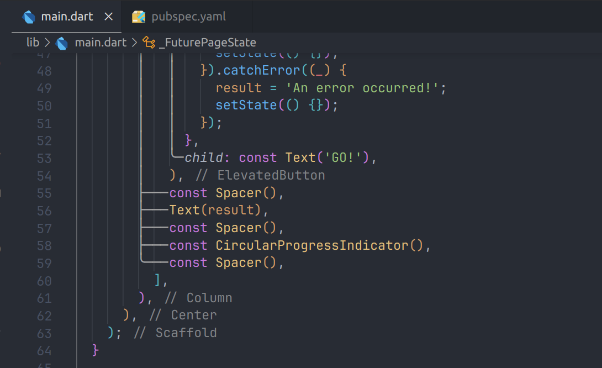
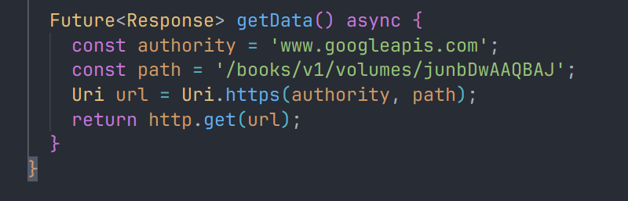
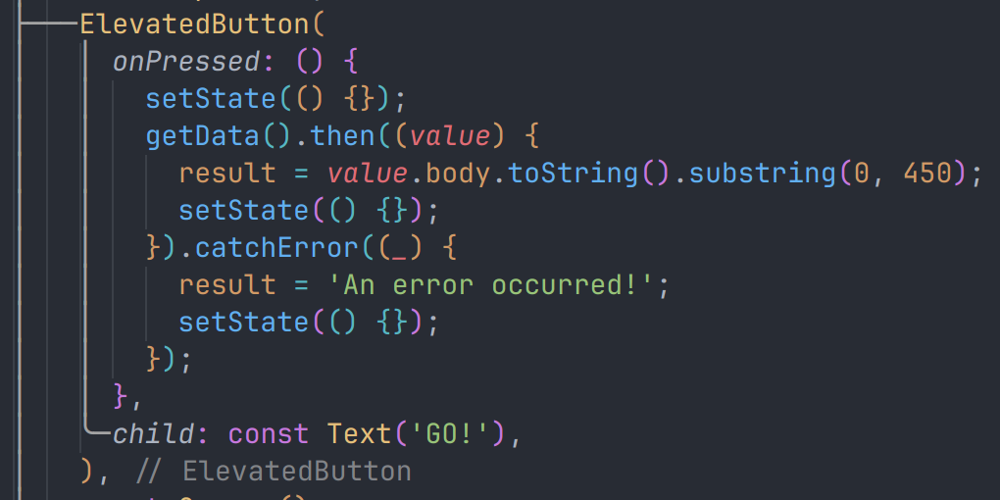
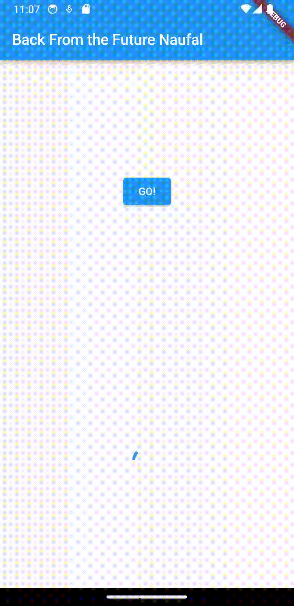

# Pertemuan Minggu 12 | Program Asynchronous
---

## Mengunduh Data dari Web Service

### Menambahkan dependensi ```http```
Jika berhasil install plugin, pastikan plugin ```http``` telah ada di file ```pubspec``` ini seperti berikut.


### Buka file ```main.dart```
ketik kode dibawah ini



### Tambah method getData()
Tambahkan method ini ke dalam ```class _FuturePageState``` yang berguna untuk mengambil data dari API Google Books.


### Tambah kode di ElevatedButton
Tambahkan kode pada ```onPressed``` di ```ElevatedButton``` seperti berikut.


### Hasil 


#### Soal 1
Tambahkan nama panggilan Anda pada ```title``` app sebagai identitas hasil pekerjaan Anda.


### Soal 2
Carilah judul buku favorit Anda di Google Books, lalu ganti ID buku pada variabel ```path``` di kode tersebut. Caranya ambil di URL browser Anda seperti gambar berikut ini.


### Soal 3
- Jelaskan maksud kode langkah 5 tersebut terkait substring dan catchError!
- Capture hasil praktikum Anda berupa GIF dan lampirkan di README. Lalu lakukan commit dengan pesan "W12: Soal 3".


