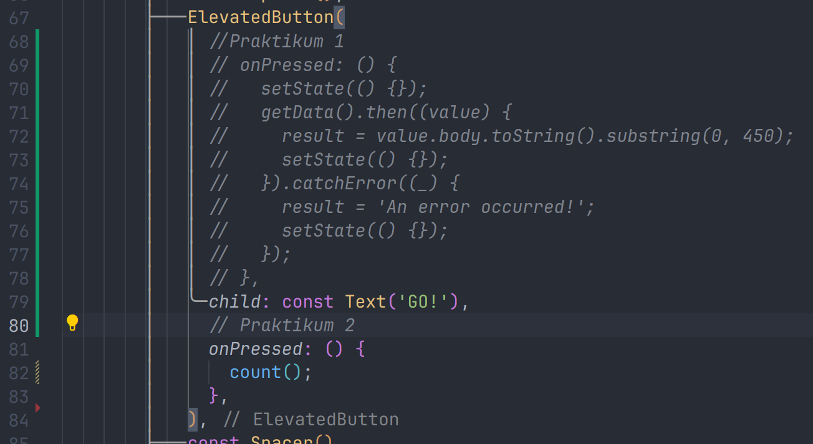

# Pertemuan Minggu 12 | Program Asynchronous
---

## Mengunduh Data dari Web Service

### Menambahkan dependensi ```http```
Jika berhasil install plugin, pastikan plugin ```http``` telah ada di file ```pubspec``` ini seperti berikut.


### Buka file ```main.dart```
ketik kode dibawah ini


### Tambah method getData()
Tambahkan method ini ke dalam ```class _FuturePageState``` yang berguna untuk mengambil data dari API Google Books.


### Tambah kode di ElevatedButton
Tambahkan kode pada ```onPressed``` di ```ElevatedButton``` seperti berikut.


### Hasil 


#### Soal 1
Tambahkan nama panggilan Anda pada ```title``` app sebagai identitas hasil pekerjaan Anda.


#### Soal 2
Carilah judul buku favorit Anda di Google Books, lalu ganti ID buku pada variabel ```path``` di kode tersebut. Caranya ambil di URL browser Anda seperti gambar berikut ini.


#### Soal 3
- Jelaskan maksud kode langkah 5 tersebut terkait substring dan catchError!
- Capture hasil praktikum Anda berupa GIF dan lampirkan di README. Lalu lakukan commit dengan pesan "W12: Soal 3".

> substring digunakan untuk mengambil substring 0 sampai 499 karakter dari teks dalam tubuh respons HTTP. ini dilakukan menggunakan metode ```substring(0, 450)``` pada String


---
## Menggunakan await/async untuk menghindari callbacks

### Buka file ```main.dart```
Tambahkan tiga method berisi kode seperti berikut di dalam ```class _FuturePageState```


### Tambahkan method ```count()```
Lalu tambahkan lagi method ini di bawah ketiga method sebelumnya.


### Panggil ```count()```
Lakukan comment kode sebelumnya, ubah isi kode ```onPressed()``` menjadi seperti berikut.


### Hasil
Akhirnya, run atau tekan F5 jika aplikasi belum running. Maka Anda akan melihat seperti gambar berikut, hasil angka 6 akan tampil setelah delay 9 detik.


#### Soal 4
- Jelaskan maksud kode langkah 1 dan 2 tersebut!
- Capture hasil praktikum Anda berupa GIF dan lampirkan di README. Lalu lakukan commit dengan pesan "**W12: Soal 4**".

> Program ini mendefinisikan tiga fungsi asinkron menggunakan kata kunci async dan await di dalamnya. Setiap fungsi adalah contoh operasi asinkron sederhana yang mengembalikan nilai setelah jeda waktu tertentu menggunakan Future.delayed.


## Menggunakan Completer di Future

### Tambahkan Variabel dan Method
Tambahkan variabel late dan method di ```class _FuturePageState``` seperti ini.


### Ganti isi kode dengan onPressed()
Tambahkan kode berikut pada fungsi ```onPressed()```. Kode sebelumnya bisa Anda *comment.* 


#### Soal 5
- Jelaskan maksud kode langkah 2 tersebut!
- Capture hasil praktikum Anda berupa GIF dan lampirkan di README. Lalu lakukan commit dengan pesan "**W12: Soal 5**".

> ```late Completer completer``` untuk deklarasi variable ```completer``` dengan tipe ```Completer```. kata kunci **late** digunakan untuk menunda inisialisasi variable hingga saat diperlukan

> ```Future getNumber()``` digunakan untuk membuat objek **Completer** dengan tipe data **int**. Kemudian memanggil fungsi **calculate**. Kemudian yang terakhir yaitu duture dari completer untuk pemanggil menunggu hasil asinkron

> ```Futeru calculate``` Menunda eksekusi selama 5 detik dengan ```await Future.delayed(const Duration(seconds: 5))```. Setelah penundaan, mengisi ```completer``` dengan nilai 42 menggunakan ```completer.complete(42)```. Ini menandakan bahwa operasi selesai dan memberikan hasilnya kepada objek ```completer```.

> Hasil


### Ganti method calculate()
Gantilah isi code method ```calculate()``` seperti kode berikut, atau Anda dapat membuat ```calculate2()```


### Pindah ke onPressed()
Ganti menjadi kode seperti berikut


#### Soal 6
- Jelaskan maksud perbedaan kode langkah 2 dengan langkah 5-6 tersebut!
- Capture hasil praktikum Anda berupa GIF dan lampirkan di README. Lalu lakukan commit dengan pesan "W12: Soal 6".

> Blok kode pertama menggunakan try-catch langsung di dalam fungsi yang berisi operasi asinkron.

>Blok kode kedua menggunakan metode then dan catchError untuk menangani hasil dan kesalahan secara terpisah setelah operasi asinkron selesai.


> 


